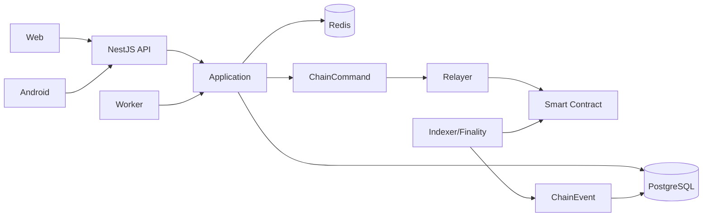

# APP IMPLEMENTATION PLAN — Account-linked Customer baseline v5.1-r4

> **Đề tài:** Xây dựng hệ thống quản lý và phân phối bản quyền phần mềm ứng dụng Blockchain  
> **Ngày cập nhật:** 17/09/2026  
> **Trạng thái:** **Baseline v5.1-r4 + implementation audit — M1 còn OPEN; không Customer Controller/per-account key/KMS**  
> **Mục tiêu:** Triển khai đủ end-to-end Blockchain licensing trong 35 capability canonical; activation key không dùng để xác thực danh tính người mua.

---

## 1. Authority

| Thứ tự | Artefact | Quyền quyết định |
|---:|---|---|
| 1 | `chuc_nang_toan_he_thong_ver2.0.md` v5.1-r4 | 35 capability, actor, state, invariant, transaction boundary |
| 2 | `sql_minimal.sql` v7.3 | Physical-schema authority tại `context/current/sql_minimal.sql`; `EmuKey/backend/database/schema.sql` là delivery mirror bắt buộc byte-identical, không phải authority thứ hai |
| 3 | `cong_nghe_he_thong.md` v5.1-r4 | Architecture, stack, ports, runtime/security/crypto protocol |
| 4 | `APP_IMPLEMENTATION_PLAN.md` v5.1-r4 | Phases, gates, dependency, traceability, DoD và mức evidence |

Các evidence/runtime của baseline cũ có Contract/signing/test_client/17-table lock chỉ là **historical** và phải re-run trước khi claim completion.

## 2. Scope khóa

### Core phải hoàn thiện sâu

```text
Plan + Terms binding
       ↓
Order snapshot + Accept Terms
       ↓
SePay Payment
       ↓
License PENDING_ONCHAIN
       ↓
ChainCommand / Relayer
       ↓
Smart Contract
       ↓
ChainEvent / Finality
       ↓
License ACTIVE
       ↓
Device Activation
       ↓
Entitlement
       ↓
Renew / Suspend / Resume / Revoke
```

### Supporting

Identity/RBAC, Provider Product/Plan, public verification, audit, notification.

### Secondary — không được chặn core release

Grounded AI, Plan advisory và realtime Support. Chỉ implement sau khi core chain flow ổn định.

### Không triển khai

Contract PDF/two-signature, Provider signing KMS, WebCrypto customer signing, contract anchor, Provider organization/member model, License Terms table/module, Kotlin test_client, iOS, NFT/wallet/crypto payment, predictive BI.

## 3. Role và ownership

- `SYSTEM_ADMIN`
- `PROVIDER_ADMIN`: chính là Provider/company account; MVP 1 account/provider.
- `CUSTOMER`: đăng ký/xác minh email/đăng nhập; sở hữu Order, License và Conversation qua `customer_user_id`.
- `SUPPORT_STAFF`

Provider ownership luôn từ `authenticatedUser.id`; không nhận provider authority từ client.

## 4. Target architecture

**Modular Monolith**. Backend có `api` + `worker` process dùng chung application/domain/PostgreSQL.



## 5. Canonical state catalog

| Aggregate | State |
|---|---|
| User | `PENDING_EMAIL_VERIFICATION`, `ACTIVE`, `LOCKED`, `DISABLED` |
| Product / Plan | `DRAFT`, `PUBLISHED`, `ARCHIVED` |
| Order | `WAITING_TERMS_ACCEPTANCE`, `WAITING_PAYMENT`, `PAYMENT_ACCEPTED`, `CANCELLED`, `EXPIRED` |
| PaymentAttempt | `PENDING`, `SUCCEEDED`, `FAILED`, `EXPIRED`, `SUPERSEDED` |
| PaymentTransaction classification | `MATCHED`, `DUPLICATE`, `UNMATCHED`, `AMOUNT_MISMATCH`, `INVALID` |
| PaymentTransaction review | `OPEN`, `RESOLVED`, `CLOSED_NO_ACTION` |
| License persisted projection/status | `PENDING_ONCHAIN`, `ACTIVE`, `SUSPENDED`, `EXPIRED`, `REVOKED` |
| License administrative state on-chain | `ACTIVE`, `SUSPENDED`, `REVOKED` |
| License temporal condition | `VALID`, `EXPIRED` từ canonical `expiresAt` |
| Customer-held activation key usability/trust | `PENDING_FINALITY`, `TRUSTED`, `UNTRUSTED_REORG` |
| LicenseDevice | `PENDING_ONCHAIN`, `ACTIVE`, `REVOKED` |
| ChainCommand | `PENDING`, `SUBMITTED`, `SUBMITTED_UNKNOWN`, `CONFIRMED`, `RETRYABLE_FAILED`, `DEAD_LETTER`, `ABANDONED`, `SUPERSEDED` |
| ChainCommand receipt (nullable trước submit) | `PENDING`, `SUCCESS`, `REVERTED` |
| ChainEvent finality | `PENDING`, `CONFIRMED`, `REORGED` |
| KnowledgeDocument | `PENDING`, `PROCESSING`, `READY`, `FAILED`, `ARCHIVED` |
| Conversation | `AI_ACTIVE`, `WAITING_SUPPORT`, `SUPPORT_ACTIVE`, `CLOSED` |
| Notification | `PENDING`, `SENT`, `RETRYABLE_FAILED`, `DEAD_LETTER` |

Không có `orders.payment_status`, `orders.rights_status`, Contract state, License/Device retry/dead-letter state.

`licenses.status` là projection persisted/flattened cho query hiện tại, không phải toàn bộ on-chain state machine. `PENDING_ONCHAIN` là provisioning state off-chain. Projection có thể materialize `EXPIRED` khi administrative state là `ACTIVE` và temporal condition đã hết hạn; License administrative `SUSPENDED` vẫn persist `SUSPENDED` dù temporal condition đồng thời là `EXPIRED`, nên consumer phải đọc thêm `expiresAt`.

Khi vẽ state diagram, tách ba chiều ở trên và không vẽ `EXPIRED` như một administrative transition on-chain độc lập. Renewal đưa temporal condition về `VALID` nhưng không tự resume. Device `REVOKED` được bind lại bằng generation mới theo cạnh `REVOKED -> PENDING_ONCHAIN -> ACTIVE`.

`ABANDONED`/`SUPERSEDED` là terminal resolution có reason/audit/typed evidence; PostgreSQL statement-stamp `resolved_at`, rồi toàn bộ row ChainCommand bất biến. `SUPERSEDED` phải được tạo atomically cùng reciprocal replacement link. `DEAD_LETTER` là parked unresolved state, không phải terminal: command chưa có raw/hash được về `PENDING` và giữ nguyên reserved nonce/payload sau revalidation; nếu nonce-only không thể reopen thì `NONCE_RESERVATION_RELEASED` giải phóng reservation có audit để đúng nonce được reuse. Raw+hash còn uncertain phải qua `SUBMITTED_UNKNOWN` để same-raw reconcile; raw cũ immutable, definitive proof chỉ resolve command cũ rồi mới tạo reciprocal replacement nếu cần. `RAW_TX_IRREVOCABLE_NO_EFFECT` không được đi cùng receipt `SUCCESS/REVERTED`; mọi proof `checkedAt` phải là RFC3339 parse được và nằm trong biên evidence -> DB-stamped resolution. Forward-admission chỉ có một actionable command/License; deep reorg có thể tạo ordered recovery set gồm nhiều command lịch sử `SUBMITTED_UNKNOWN`, và set này chặn mọi command mới.

## 6. Database plan

SQL authority `sql_minimal.sql` v7.3 có **18 tables**. `EmuKey/backend/database/schema.sql` là mirror dùng để build/delivery backend; mọi thay đổi schema phải cập nhật cả hai trong cùng change và baseline check phải chứng minh chúng byte-identical trước khi pass:

`users`, `products`, `plans`, `orders`, `payment_attempts`, `payment_transactions`, `licenses`, `license_devices`, `chain_commands`, `chain_events`, `chain_indexer_checkpoints`, `knowledge_documents`, `knowledge_chunks`, `conversations`, `messages`, `notifications`, `mobile_push_tokens`, `audit_logs`.

Quy tắc:

- Không khóa DB ở 17/18 hay bất kỳ con số cố định nào.
- Không tạo `providers`, `contracts`, `provider_signature_versions`, `license_terms`, job/cache/report table trong baseline.
- Bảng mới phải có lifecycle/query/business rule độc lập + capability ID trực tiếp.
- Critical transaction test bằng PostgreSQL thật; thay đổi schema bằng SQL được review; không ORM synchronize.
- Không tự suy việc sửa authority SQL đồng nghĩa database đang chạy đã được apply/reset; thao tác dữ liệu thật là gate vận hành riêng.
- Redis được phép giữ cache, lock, rate limit, refresh/session token, one-time challenge/action token, encrypted activation envelope và BullMQ scheduling vì đây là operational/ephemeral state. Redis không được là nguồn duy nhất của durable business authority như Order, Payment, License/Device projection, ChainCommand/Event hoặc Audit; mất Redis không được tự thay đổi rights canonical.
- SQL target bắt Order mới vào `WAITING_TERMS_ACCEPTANCE`; DB statement-stamp Order/Attempt lifecycle và IPN receive time; guard immutable cutoff, late-correction provenance và exact Order↔Attempt↔effect amount/time/status hai chiều theo thứ tự effect -> late-correct Attempt -> `PAYMENT_ACCEPTED`; review `NONE -> OPEN -> terminal` với terminal/effect tuple bất biến. License purchase phải có exact accepted durable effect, `period_start = provider_occurred_at`, quota snapshot và ISSUE cùng transaction; ISSUE/RENEW command phải trỏ Order có exact paid effect. Projection/command↔confirmed-event pointer hai chiều, trỏ latest canonical event đúng loại và tối đa một confirmed event/command; Device pending không được còn canonical confirmed event. Expiry chỉ đổi một lần theo exact renewal pointer transition và chỉ giảm khi exact renewal reorg rollback. Contiguous predecessor, latest-confirmed basis cho non-ISSUE, reciprocal replacement cùng operation/subject và ISSUE replacement-only; per-License admission; terminal command row bất biến hoàn toàn; typed resolution proof có bounded valid RFC3339 `checkedAt`, no-effect proof loại receipt definitive. ChainEvent insert-`PENDING`, identity/decoded key evidence bất biến, timestamp chronological, re-inclusion sau prior reorg và monotonic reorg summary; ISSUE re-confirm sau deep reorg atomically phục hồi earliest unresolved ROTATE pending pointer/key nhưng giữ `UNTRUSTED_REORG`. No-delete durable evidence và Message idempotency key. Application vẫn phải có cùng transaction/race/negative tests, không dựa riêng vào trigger.

## 7. Service Terms và commitment

- Một platform Service Terms content owner trong application source control; mỗi Order lưu DB-stamped `service_terms_accepted_at`.
- Plan publish không nhận hoặc lưu Terms fields.
- Published Plan immutable; thay đổi Terms/rights -> Plan version mới.
- Order snapshot đúng version/hash và `plan_commitment`.
- Customer owner explicit accept bằng JWT; không chữ ký PDF, Customer Controller hay khóa riêng theo account.
- Service Terms không nằm trong Plan commitment hoặc blockchain; blockchain chỉ giữ commitment opaque.

## 8. Transaction matrix bắt buộc

| Use case | DB transaction | Async/chain gate |
|---|---|---|
| Register | User pending | Verify token sau commit |
| CreateOrder | Lock Plan + luôn khởi tạo `WAITING_TERMS_ACCEPTANCE` + immutable price/Terms/payment snapshots; chốt `payment_due_at` và `ipn_accept_until = payment_due_at + IPN_DELIVERY_GRACE` | none |
| AcceptServiceTerms | Order ownership + `{ accepted: true }` -> WAITING_PAYMENT | none |
| Checkout | Lock Order; chỉ `WAITING_PAYMENT` đã accept Terms; amount = snapshot, `attempt.expires_at <= payment_due_at`; reuse pending attempt còn hạn hoặc expire/supersede attempt cũ; không tạo/hủy sau due | SePay UI/QR; attempt expiry không tự expire Order, Order chờ payment đi callback-only đến snapshot `ipn_accept_until` |
| IPN Purchase | PostgreSQL đóng dấu `received_at`; chỉ từ `WAITING_PAYMENT` đã accept exact Terms; normalized provider event + exact Transaction amount↔Attempt amount↔Order price; `provider_occurred_at` thuộc `[max(terms_accepted_at, attempt.created_at), min(attempt.expires_at, payment_due_at))`, nếu superseded còn `< superseded_at`, và `received_at < ipn_accept_until`. Cùng transaction ghi durable effect trước, late-correct exact Attempt sang `SUCCEEDED` nếu cần, rồi mới project Order `PAYMENT_ACCEPTED`; create License pending với `period_start = provider_occurred_at`, exact quota snapshot và sequenced ISSUE. License/ISSUE không được tồn tại thiếu exact paid effect | Sau commit chuẩn bị/verify encrypted envelope; Relayer chỉ submit khi envelope/commitment/expiry hợp lệ; rights/key chưa usable; proposal hết hạn trước submit -> ABANDONED + MATCHED fulfillment review/refund |
| IPN Renewal | Composite-check target cùng owner/Provider/Product/Plan/commitment; exact Renewal Order phải có `PAYMENT_ACCEPTED` durable effect trước atomic handoff sang sequenced RENEW command với expiry `addPlanDuration(max(canonical expiresAt, verified provider_occurred_at), duration_months)` | expiry chưa đổi trước finality; lane conflict lưu review, không tạo command thứ hai |
| Activate | Verify Customer ownership + bearer key + one-time challenge bind protocol/domain/action/license/device/generation/version/nonce/expiry; atomically consume nonce; lưu signer address; Device pending + request-scoped ACTIVATE command | Smart contract enforce state/expiry/version/uniqueness/quota; entitlement chờ finality |
| Rotate | Verify owner + current key + recent re-auth + token `ROTATE_KEY`; giữ current commitment/version/trust, ghi pending next commitment/version + exact `pending_activation_command_id` trỏ request-scoped ROTATE; không external envelope call trong DB transaction | Sau commit prepare/verify envelope; `KEY_ROTATED` phải mang decoded previous/new commitment+version đúng sequence; finality mới promote pending -> current và release plaintext |
| Self-revoke Device | Verify owner + current key + fresh target proof + token bind `SELF_REVOKE_DEVICE/deviceRef/generation`; pending request-scoped command + audit | projection sau finality |
| Remote-revoke Device | Verify owner + recent re-auth + current key + token bind `REMOTE_REVOKE_DEVICE/deviceRef/generation`; không yêu cầu proof/private key của thiết bị bị mất | projection sau finality; nếu mất current key thì owner recovery trước |
| Owner key-recovery | Verify owner session + recent password re-auth + action token bind `KEY_RECOVERY`; không yêu cầu current key; serialize License + next ROTATE | chỉ tạo sau command/finality cũ đã resolve; same envelope/finality/one-time delivery, không mutate commitment cũ |
| License state request | Command + audit | projection sau finality |
| Chain apply | Event mới luôn vào `PENDING`; event phải khớp command/subject/type/network/chain/contract/tx và decoded key evidence khi là ISSUE/ROTATE; tối đa một confirmed event/command; finality + latest reciprocal projection pointer đúng loại + command/projection state trong transaction | Event identity/decoded evidence bất biến; reinclusion được thay occurrence evidence có kiểm soát và giữ monotonic summary latest timestamps/count, không phải full ledger; notify sau commit; rebuild theo command sequence/dependency |
| Entitlement issue/refresh/verify | Owner + fresh device proof cho issue/refresh; verify signed token rồi re-read canonical projection/version | token TTL tối đa 5 phút; state/version change invalidates token cũ |
| Conversation | CAS + message + assignment audit | **TARGET Phase 7:** Socket emit sau commit; runtime hiện dùng HTTP/polling |

## 9. Phase plan

### Phase 1 — Baseline reset & traceability

**Trạng thái:** `DOCUMENT_STATIC_PASS / OPEN_TRACEABILITY_AND_EXECUTABLE_CRYPTO` — authority FUNC/TECH/PLAN v5.1-r4 và SQL v7.3 đã đồng bộ; static audit ngày 17/09/2026 xác nhận 35 capability, 18 bảng, 33 Gap/Gate ID không trùng, 29 acceptance liên tục và SQL authority/mirror byte-identical. Ma trận per-capability `API/use case/table/test owner`, TypeScript/Solidity crypto vectors và executable runtime evidence vẫn OPEN trong lượt chỉ rà tài liệu này.

**Mục tiêu:** khóa baseline v5.1 với 35 capability, owner/state/crypto protocol và dependency đủ để implement.

- Đồng bộ version/header/authority 4 artefact.
- Loại mọi **active dependency/schema/runtime/feature reference** tới Contract/signing/test_client/67-feature/17-table lock; cho phép nhắc trong Out-of-scope/Revision history.
- Trace 35 capability -> API/use case/table/test owner.
- Chốt owner duy nhất: `CAT-05` ComparePlans, `BC-04` Reconcile, `BC-05` Public Blockchain Verification.
- Khóa crypto spec: Terms normalization/hash, JCS entitlements, ABI plan commitment và activation commitment.

**Gate:** validator phân biệt active vs historical mention; count capability = 35; SQL inventory khớp TECH/PLAN; TypeScript/Solidity crypto test vectors định nghĩa xong.

### Phase 2 — Schema & foundation

**Trạng thái:** `TARGET_SCHEMA_V7.3_REAL_DB_APPLIED_SEED_TWICE_PASS / OPEN_FULL_NEGATIVE_ACCEPTANCE` — authority/mirror v7.3 byte-identical đã create/commit thành công trên PostgreSQL 15 + pgvector disposable với 18 bảng, không có constraint chưa validate hoặc index invalid. Representative fixtures đã pass cho paid-origin License/commerce command, ordered late correction, full terminal-command immutability + bounded proof, Device pending projection, one-transition renewal expiry apply/rollback, ChainEvent chronology/re-inclusion và deep ISSUE re-confirmation khôi phục earliest unresolved ROTATE. Database Neon `EmuKey` đã được reset/import transactionally, verify `18 bảng / 229 constraint / 50 foreign key / 115 index`, seed-twice giữ nguyên `4 users / 1 product / 2 plans`; toàn bộ negative matrix chưa hoàn tất nên Phase 2 vẫn chưa PASS.

- SQL schema v7.3 target đã pass disposable clean-room, reset/apply database Neon thật, seed-twice idempotency và các representative fixture nêu trên; còn full negative acceptance, không dùng ORM/autosync.
- Verify phần matrix còn lại cho composite integrity: exact Order price/time/cutoff↔PaymentAttempt↔effect transaction; immutable terminal review/effect linkage; RenewalOrder↔License owner; Product↔Plan↔Order/License; projection/confirmation pointer↔duy nhất một CONFIRMED ChainEvent đúng subject/decoded key evidence; contiguous predecessor/basis, reciprocal replacement và ChainCommand provider/order subject; pending ROTATE pointer↔pending key tuple.
- Seed đủ 4 role, gồm demo Customer/Provider account và Product/Plan.
- Redis/session/config/log redaction.
- Audit plumbing (`OPS-02`) cho auth/security/mutation từ foundation; dashboard để Phase 7.
- Ports/fakes cho SePay, EVM, Storage, AI và Notification.
- OpenAPI contract/snapshot + generated TypeScript types cho Web/Mobile; HTTP runtime hiện dùng wrappers viết tay, không được gọi là generated client hoàn chỉnh.

**Gate:** SQL schema clean-room + seed idempotent; deliberate cross-subject FK fixtures phải fail; no secret in repo/log; audit baseline hoạt động.

### Phase 3 — Identity + Catalog + Terms

**Trạng thái:** `IMPLEMENTED_LOCAL / OPEN_POLICY_GAPS` — Identity/RBAC, Provider isolation, Catalog/Plan lifecycle, Terms loader và plan commitment có implementation/test; password reset/change, verification resend/reissue và multi-version Terms manifest chưa khớp policy canonical.

Capability: `AUTH-01..04`, `CAT-01..05`.

- Customer registration/email verification, auth/session/RBAC và Customer/Provider ownership.
- Không sinh Customer Controller, wallet hay khóa riêng theo tài khoản; Order dùng Customer JWT + UUID idempotency key.
- Product/Plan lifecycle.
- `ARCHIVED` chặn purchase và renewal Order mới; License hiện hữu tiếp tục đến expiry/revoke, không bị archive tự động thu hồi.
- Global Terms version/hash loader.
- Plan publish immutable + deterministic plan commitment theo exact ABI encoding.
- Public catalog/`CAT-05 ComparePlansQuery`; AI sau này chỉ reuse query này.
- Implement Terms/entitlements/plan commitment TypeScript test vectors.
- Enforce đồng nhất policy canonical đã chốt cho register/reset/change password: tối thiểu 8 ký tự + hoa/thường/số/ký tự đặc biệt; logout revoke toàn account session qua `session_version` và phải được UI mô tả đúng.
- Bổ sung resend/reissue verification token có rate limit, invalidate token cũ có chủ đích và cleanup/change-email policy cho account `PENDING_EMAIL_VERIFICATION`.
- Thay một `TERMS_APPROVED_HASH` toàn cục bằng manifest immutable `version -> hash` trước khi có Terms v2, để historical Order vẫn tải/verify được Terms v1.

**Gate:** Provider A cannot touch Provider B; provider chain identity không đổi sau publish; published Plan cannot mutate rights/Terms; exact crypto vector stable và sẵn sàng đối chiếu Solidity.

### Phase 4 — Order + SePay

**Trạng thái:** `IMPLEMENTED_LOCAL / OPEN_ACCEPTANCE_TESTS` — Order/Terms/Checkout/IPN/payment evidence/review/receipt và renewal command có implementation; SePay Sandbox đã test riêng. Duplicate/out-of-order/concurrent IPN, payment-review business outcome, state expiry/supersede, renewal single-flight/reorg dependency và negative matrix chưa đủ executable evidence.

Capability: `COM-01..06`.

- Create Order snapshot.
- Accept Terms.
- PaymentAttempt/SePay IPN.
- Duplicate/out-of-order/concurrent IPN.
- Composite PaymentTransaction↔Attempt↔Order negative tests.
- Payment review/history/derived receipt.
- Payment review giữ immutable provider evidence/classification và state graph `NONE -> OPEN -> RESOLVED|CLOSED_NO_ACTION`; terminal review cùng effect tuple `(order_id, payment_attempt_id, resolution)` bất biến. `UNMATCHED/AMOUNT_MISMATCH/INVALID` bắt đầu OPEN; clean `MATCHED` và exact-linked `DUPLICATE` không review, trừ MATCHED có downstream fulfillment failure trước usable rights. Chỉ System Admin resolve bằng `REMATCHED`, `ACCEPT_AND_FULFILL`, `REFUND_CONFIRMED`, `NO_ACTION`; fulfillment chỉ từ `WAITING_PAYMENT` đã accept exact Terms, exact amount, provider time trong exact interval và webhook nhận trước snapshot cutoff. `AMOUNT_MISMATCH` không accept trực tiếp; MATCHED fulfillment failure/terminal Order chỉ refund/no-action.
- Renewal Order creation only; Customer phải trình activation key hiện hành và DB phải chặn target License khác Provider; chưa update License expiry.
- New purchase phải ghi proposed `period_start = verified provider_occurred_at`, expiry bằng canonical `addPlanDuration`, rồi chỉ coi expiry authoritative sau ISSUE finality.
- Renewal phải giữ nguyên Product/Plan/commitment và tính expiry bằng `addPlanDuration(max(canonical expiry, verified provider_occurred_at), duration_months)`; đây là conformance gap cho đến khi repository/test được sửa.
- Renewal single-flight phải khóa xuyên open Order, actionable command, mọi `SUBMITTED_UNKNOWN` và unresolved `DEAD_LETTER`. Command ghi sequence/predecessor/basis event; target SQL chỉ guard forward-admission, application per-License lock chịu cross-segment/recovery set.
- Worker/API phải transition đúng bằng DB-stamped lifecycle: attempt timeout tại/sau `expires_at` chuyển `PaymentAttempt.EXPIRED`, còn `SUPERSEDED` chỉ trước expiry. On-time provider payment nhận trước Order cutoff được exact-evidence correction `EXPIRED|SUPERSEDED -> SUCCEEDED` khi Order còn `WAITING_PAYMENT`; nhánh superseded bắt buộc payment xảy ra trước `superseded_at`, effect được ghi trước correction, provenance `corrected_from_status/correction_boundary_at` bất biến và mọi attempt khác còn pending được supersede atomically. Order chưa accept Terms expire tại due; Order chờ payment từ due đến immutable `ipn_accept_until` là callback-only, không accept Terms/tạo attempt/hủy; tại/sau cutoff expire và atomically đóng pending attempts; terminal Order không hồi sinh.

**Gate:** Payment success never makes rights usable by itself; cross-order/cross-provider payment-renewal linkage bị DB từ chối; review outcome và renewal single-flight/reorg dependency có executable race tests.

### Phase 5 — Blockchain Core + License issuance

**Trạng thái:** `IMPLEMENTED_LOCAL_REAL_RPC / SEPOLIA_ISSUE_EVIDENCE / OPEN_CONFORMANCE_AND_PRODUCTION` — Contract, relayer, durable command, local Hardhat JSON-RPC golden flow, indexer/finality/reorg/reconcile và issuance happy path đã chạy. Endpoint `BC-05` đã có; phần còn thiếu là direct conformance test matrix, multi-event reorg, dead-letter recovery và full commerce-to-Sepolia E2E, vì vậy Phase 5 chưa được gọi là DONE.

Capability: `LIC-01..03`, `BC-01..05` minimum for issue/read; public verify thuộc `BC-05`.

- Smart Contract Registry.
- `chain_commands` submit/idempotency/per-License sequence+dependency/latest-confirmed basis cho non-ISSUE/nonce/unknown/retry/manual resolution (`ABANDONED`, `SUPERSEDED`); ISSUE luôn basis `NULL`. Replacement phải là reciprocal one-to-one link, có sequence lớn hơn và cùng operation/subject/provider/network/chain/contract; ISSUE sequence > 1 chỉ là replacement. Terminal resolution ghi typed JSON với bounded valid RFC3339 `checkedAt`; nonce-only có audited release/reuse, còn raw đã broadcast luôn immutable và chỉ same-raw reconcile cho đến receipt `REVERTED` hoặc finalized nonce-consumption + canonical no-effect proof resolve command cũ. No-effect proof loại receipt `SUCCESS/REVERTED`; khi `ABANDONED/SUPERSEDED`, toàn row immutable.
- `chain_events` mới vào `PENDING`; indexing/finality + summarized reorg evidence; identity/decoded evidence bất biến, timestamp chronological, reinclusion chỉ theo state graph cho phép sau prior reorg và update monotonic latest timestamps/count, tối đa một event `CONFIRMED` mỗi command. Event apply phải khớp command/subject/type/network/chain/contract/transaction; License/Device reciprocal projection pointer phải trỏ latest `CONFIRMED` đúng loại, Device pending không được còn confirmed canonical event. Expiry chỉ tăng một lần khi pointer sang exact renewal confirmation và chỉ giảm khi pointer rời exact renewal reorg.
- NEW_PURCHASE -> ISSUE_LICENSE.
- Activation secret/commitment + encrypted envelope preparation; ISSUE relayer hard-precondition kiểm tra envelope tồn tại và commitment khớp trước submit.
- Nếu envelope preparation lỗi, chỉ regenerate secret/commitment atomically khi ISSUE còn `PENDING` và `nonce`, `signed_transaction`, `transaction_hash` đều `NULL`; từ khi bất kỳ field nào có giá trị thì commitment immutable.
- Projection pointer composite integrity + `BC-04` reconcile.
- `BC-05` public verification endpoint cho tx/event/finality/plan commitment đã có; còn thiếu executable conformance matrix cho allowlist/no-PII/rate-limit/pending/stale/reorg/not-found. `LIC-03` chỉ portal projection read.

**Gate:** test proves `PAYMENT_ACCEPTED + chain pending/reorg` cannot return ACTIVE/key/entitlement; ISSUE không submit nếu envelope thiếu/mismatch; TypeScript plan commitment khớp Solidity vector; direct command-event identity/finality matrix, lowercase EVM identity matrix và `BC-05` conformance matrix pass.

#### Mức evidence Sepolia — không được dùng thay thế lẫn nhau

| Level | Bằng chứng yêu cầu | Trạng thái hiện tại |
|---|---|---|
| `SEP-1 DEPLOY` | Đúng chain ID, contract address/deployment block, ABI và deployment/verification artefact | Có evidence deploy Sepolia |
| `SEP-2 CONTRACT_TX` | Relayer gửi transaction thật; có hash, receipt, event và gas evidence | Có evidence cho issuance |
| `SEP-3 BACKEND_PIPELINE` | Durable ChainCommand -> relayer -> indexer -> finality -> projection qua backend/worker thật | Có evidence cho ISSUE ở mức riêng lẻ; chưa phải automated external E2E và chưa bao phủ đầy đủ Phase 6 |
| `SEP-4 EXTERNAL_E2E` | Web/Android -> SePay Sandbox IPN -> backend/worker -> Sepolia finality -> key/device/entitlement | `OPEN`; là bằng chứng riêng, không được suy ra từ `SEP-1..3` |

“Có evidence” trong bảng là inventory của artefact/lần chạy đã ghi nhận, không tự động là acceptance PASS hiện tại. Mỗi milestone/release phải re-run mức yêu cầu bằng cấu hình, transaction hash, block/receipt/event và test output có thể truy vết; deploy/verify contract không chứng minh relayer/indexer hay external commerce flow.

### Phase 6 — Device + entitlement + lifecycle

**Trạng thái:** `LOCAL_REAL_RPC_PARTIAL / OPEN_REMOTE_RECOVERY_SEPOLIA_AND_EXTERNAL_E2E` — Backend/API, owner-scoped device proof/commands, purpose+generation-bound one-time challenge, rotate, entitlement, lifecycle, canonical finalized-block time cho expiry, Web/Mobile surfaces và Docker-backed local Hardhat golden flow đã có. Golden flow ngày 18/09/2026 đã chạy thật qua ISSUE → activate → entitlement → rotate → revoke device → reconcile → renewal → suspend/resume → race/replay → expiry → reorg; command mất confirmation về `SUBMITTED_UNKNOWN` và descendant chưa submit bị park `DEAD_LETTER`. Chưa đạt Gate vì remote revoke/key recovery, full compatibility matrix/manual recovery, Sepolia Phase 6 và Web/Mobile external E2E chưa đầy đủ.

Capability: `LIC-02`, `LIC-04..08`.

- Normal rotate dùng owner JWT + current activation key + recent password re-auth + one-time token `ROTATE_KEY`; current commitment/version/trust không đổi trước finality, pending next key thuộc exact `pending_activation_command_id`/envelope; `KEY_ROTATED` decoded evidence phải khớp previous/current và new/pending tuple; chain command chỉ do relayer được phép gửi.
- Device activation: backend verify bearer secret và protocol/domain-separated device proof; lưu lowercase signer address, secret/private key không lên chain; contract enforce state/expiry/current key-version/device uniqueness/quota.
- Self-revoke dùng owner JWT + token `SELF_REVOKE_DEVICE` bind exact Device/generation + current key + fresh target-device proof, không yêu cầu password re-auth riêng. Remote revoke dùng token `REMOTE_REVOKE_DEVICE` bind exact Device/generation + owner JWT + recent password re-auth + current key nhưng không target-device proof; token không dùng chéo action/Device/generation. Nếu current key mất thì owner recovery trước.
- Owner key-recovery không yêu cầu key đã mất: session + recent password re-auth + email token bind `KEY_RECOVERY`, strong rate-limit/audit, rồi tạo ROTATE mới sau khi command/finality cũ đã resolve.
- Signed entitlement issue/refresh dùng fresh device proof; verify re-check projection/finality/keyVersion/entitlementVersion và TTL tối đa 5 phút.
- Renewal apply, suspend/resume/revoke; expiry worker chỉ derive `EXPIRED` từ on-chain `expiresAt` và timestamp của latest finalized block, fail closed khi finalized head stale/unavailable.
- Race/retry/reorg/replay tests; rollback từ fork point giữ durable summarized finality/reorg evidence. Chỉ command mất matching canonical confirmation của chính nó demote `SUBMITTED_UNKNOWN`; command còn canonical event giữ `CONFIRMED`. Descendant chưa submit dựa orphaned basis park `DEAD_LETTER`; non-ISSUE reopen/submit phải recheck latest-confirmed basis. Nonce-only có thể audited release nếu basis không trở lại; raw đã broadcast không được rewrite, chỉ same-raw reconcile rồi resolve command cũ bằng typed definitive proof trước khi tạo reciprocal replacement. Không mở command mới khi suffix chưa resolve.
- Idempotency phải request-scoped; không reuse command `CONFIRMED` cũ cho chu kỳ suspend→resume→suspend hoặc activate→revoke→activate.
- Có compatibility/serialization matrix cho mọi command chưa resolve cùng License (`RENEW`, `ROTATE`, activate/revoke Device, suspend/resume/revoke License); sequence/predecessor/basis event không cho command dùng stale state/key version.
- Rebind cùng Device sau revoke phải tăng `binding_generation`; command chỉ deduplicate trong cùng logical request/generation.
- Device challenge phải bind purpose/action, License, Device reference/generation, key version, nonce, expiry và protocol/domain; atomically consume một lần.
- License state diagram tách administrative state khỏi temporal expiry; renewal của License suspended không được tự resume.
- Envelope chỉ regenerate trước nonce/raw tx/hash. Sau submit nhưng trước finality chỉ key-unavailable + reconcile; payload/commitment đã chuẩn bị là immutable. Sau resolution, response-loss/Customer mất key hoặc `KEY_ROTATED` đã giao bị mất canonical dùng owner-recovery ROTATE. Nếu `LICENSE_ISSUED` mất canonical thì same-raw reconcile/rebroadcast trước; chỉ khi transaction cũ chắc chắn không thể áp dụng mới atomically link replacement ISSUE với commitment đã chốt hoặc refund, không ROTATE License chưa tồn tại canonical.
- ISSUE proposal dùng `PENDING_FINALITY -> TRUSTED`; proposal immutable ngay khi bất kỳ ISSUE lineage command đã có nonce/raw/hash. Rotate giữ current key `TRUSTED` và next key + exact pending-command pointer cho đến khi matching `KEY_ROTATED` decoded evidence finality atomically promote. Reorg sau delivery rollback đúng previous/new evidence, chuyển `UNTRUSTED_REORG` và chặn activation-key-dependent action/entitlement đến re-confirm; deep ISSUE reorg clear pending ROTATE projection pointer nhưng vẫn giữ ordered unresolved ROTATE command/evidence suffix. Khi ISSUE confirm lại, cùng transaction phục hồi exact pending pointer/key của earliest unresolved ROTATE và vẫn `UNTRUSTED_REORG` cho đến khi suffix canonical hết. Chỉ `KEY_ROTATED` orphan trên License còn canonical mới đi owner recovery; ISSUE orphan đi same-raw issue-recovery rồi replacement/refund.

**Gate:** chain controls every rights transition; stale key-version, duplicate command/nonce, incompatible concurrent command, cross-action/replayed proof, over-quota device và backend-only ACTIVE/EXPIRED mutation đều bị từ chối; remote revoke/key recovery có deterministic audited path.

### Phase 7 — Assistance + Operations

**Trạng thái:** `OPEN` — Phase 7 bao phủ 7 ID (`AST-01..04`, `OPS-01..03`): 6 capability hoàn toàn chưa hoàn tất, còn `OPS-02` mới có foundation plumbing ở Phase 2 nhưng chưa đạt Phase 7 end-to-end. Không thuộc phạm vi hoàn tất Phase 1–6.

Capability: `AST-01..04`, `OPS-01..03` (`OPS-02` plumbing đã bắt đầu từ Phase 2).

- Minimal Knowledge/RAG + source/refusal; AI Plan advisory chỉ reuse `CAT-05`.
- Unified AI/Support Conversation; mọi Customer/Support append dùng stable client UUID, AI/System dùng stable event/job UUID để retry không tạo Message/server sequence mới.
- Notification/push.
- Hoàn thiện audit/dashboard/health; Provider chỉ xem aggregate của mình, còn manual `BC-04` chỉ System Admin có audit; Operations UI không implement engine riêng.

**Gate:** AI read-only, Support boundaries, Message append idempotent cho mọi sender, notification failures không rollback business; không có duplicate ComparePlans/Reconcile/PublicVerify implementation.

### Phase 8 — Hardening & release

**Trạng thái:** `OPEN/BLOCKED_FOR_PRODUCTION` — Playwright/Maestro spec đã có nhưng chưa chạy full external flow; còn security/load/release evidence, secret/RPC/TLS/deployment gates.

- E2E Web + Android.
- Security/PII/secret scan.
- Load budget cho checkout/public verify/activation.
- Sepolia evidence theo level `SEP-1..4` + local deterministic demo; không dùng deploy/tx evidence để claim full external E2E.
- Backup/restore/reconcile/runbooks.
- Deployment/TLS/monitoring.

**Gate:** đánh giá theo acceptance target §16 và milestone boundary §13: M1 chỉ dùng mandatory subset đã liệt kê nhưng mọi security-blocking/conformance gap áp dụng phải `CLOSED`; M2/Production không được dùng M1 evidence để bỏ qua phần Phase 8 còn lại.

## 10. Capability implementation matrix

| Module | IDs | Phase |
|---|---|---:|
| Identity | `AUTH-01..04` | 3 |
| Catalog | `CAT-01..05` | 3 |
| Commerce | `COM-01..06` | 4 |
| Licensing | `LIC-01..08` | 5–6 |
| Blockchain | `BC-01..05` | 5–6 |
| Assistance | `AST-01..04` | 7 |
| Operations | `OPS-02` foundation ở 2; `OPS-01/03` hoàn thiện ở 7 | 2, 7 |

**35/35 capability hiện có capability row và phase mapping; ma trận per-capability `API/use case/table/test owner` vẫn OPEN ở Phase 1, nên chưa được gọi là traceability complete.** Có 28 core ID nằm ở Phase 1–6; cộng `OPS-02` foundation tạo 29 phase assignments nhưng không biến `OPS-02` thành Phase 7 complete. Phase 7 bao phủ 7 ID (`AST-01..04`, `OPS-01..03`): 6 ID hoàn toàn chưa hoàn tất, `OPS-02` mới partial foundation. Các executable Phase 7 path/test-owner paths cho end-to-end behavior vẫn thiếu hoặc chưa được chứng minh. Android/Web coverage không tạo thêm capability ID.

## 11. Owner và dependency bắt buộc

| Concern | Owner duy nhất | Consumer |
|---|---|---|
| Compare Plan | `CAT-05` | Web, Android, `AST-02` |
| Public blockchain verify | `BC-05` | Public Web/API |
| Projection/reconcile engine | `BC-04` | Worker, `OPS-03` UI |
| Payment event classification | `COM-04` | `COM-05`, Ops |
| License projection read | `LIC-03` | Customer/Provider portal |
| Activation key lifecycle | `LIC-02` | `LIC-04`, Chain submit precondition |

Không module/surface nào được tạo implementation thứ hai cho các concern trên.

## 12. Surface mapping tối thiểu

### Web

| Surface | Trạng thái 17/09/2026 |
|---|---|
| Public catalog/compare + public License verify | API/UI/endpoint có; BC-05 còn thiếu direct conformance test matrix cho PENDING/STALE/REORGED/no-PII/rate-limit/not-found |
| Customer auth/profile, checkout/payment status, License/device/renewal | API/UI có; Phase 6 ownership, renewal và external E2E gaps vẫn mở |
| Customer AI/Support | UI placeholder/mock; Phase 7 backend OPEN |
| Provider profile, Product/Plan, Orders/Payments, License lifecycle | API/UI có ở mức Phase 1–6 |
| Provider Knowledge/dashboard | Screen/placeholder có; Knowledge/Operations backend Phase 7 OPEN |
| Support queue/conversation | UI mock; Phase 7 OPEN |
| System users/payment review/chain health/reconcile | API/UI một phần; audit/integration-job views chưa phải full Operations flow |

### Android

- Đã có Customer login, Catalog/compare, checkout/payment status và License/key/device/renewal dùng chung API.
- SecureStore giữ access token, activation key, random device reference và device private key; entitlement token ngắn hạn chỉ ở memory.
- Mobile chưa gọi refresh-token rotation; access token hết hạn hiện yêu cầu đăng nhập lại.
- Public verification, AI/Support và notification/push là target surface; không được vẽ như backend Phase 7 đã hoàn tất.
- Maestro activation spec đã có nhưng chưa được thực thi trong CI/device thật.

Không có C01/Kotlin client và không khóa screen count trước khi Figma được refactor theo capability mới.

## 13. Critical path

```text
P1 Baseline
 -> P2 Foundation
 -> P3 Identity/Catalog/Terms
 -> P4 Commerce/Payment
 -> P5 Blockchain Issue/Finality
 -> P6 Device/Entitlement/Lifecycle
 -> P8 Hardening
```

Phase 7 Assistance/Operations có thể chạy sau P5 foundation nhưng **không được làm chậm P5/P6**.

### Milestone

- **M1 — Blockchain-core thesis/demo: OPEN.** Cần Phase 1–6 đạt đúng acceptance và đóng tập Phase 8 bắt buộc cho demo bên dưới; local integration hiện chưa thay thế real Web/Android E2E và các conformance gap.
- **M2 — Full target v5.1:** hoàn tất Phase 7 + toàn bộ Phase 8. AI/Support/notification nâng trải nghiệm nhưng không thay đổi M1 rights authority.

Không được dùng việc Phase 7 chưa xong để hạ chuẩn test/gate của M1.

**Phase 8 mandatory subset cho M1** gồm:

1. Core Web E2E và Android device/entitlement E2E qua cùng backend; ít nhất một flow external `SEP-4` tái lập được bằng SePay Sandbox + Sepolia.
2. Security-blocking gaps, authorization negative tests, secret/PII scan và activation plaintext/log scan đều pass.
3. Local deterministic real-RPC suite cho retry/race/reorg/nonce/receipt/reconcile; Sepolia đạt `SEP-3` cho issuance và các Phase 6 lifecycle path dùng trong demo.
4. Demo runbook cho deploy/configure, recovery/reconcile và evidence capture; không phụ thuộc state thủ công không được ghi lại.

Full production load budget, backup/restore drill, CD, domain/TLS, monitoring/SLA và production merchant/secret governance vẫn là phần Phase 8 của M2/Production, không được suy là đã đạt chỉ vì M1 demo pass.

## 14. Work package rules

Mỗi task phải có:

- capability ID;
- actor/input/output;
- owner table/state;
- transaction boundary;
- idempotency/concurrency rule nếu mutation;
- security negative test;
- stop condition.

Không tạo task kiểu “build mobile feature X” nếu backend capability đã có; task UI chỉ là surface coverage.

## 15. Gate và conformance gap hiện tại

| ID | Trạng thái | Gate / Blocking |
|---|---|---|
| `GAP-P2-DB-NEGATIVE` | PARTIAL, acceptance blocking | Representative Order/payment/chain negative fixtures và seed-twice idempotency đã pass; còn cross-subject FK/full matrix trước khi Phase 2 đạt Gate |
| `GAP-P2-SCHEMA-V73` | PARTIAL, acceptance blocking | Disposable create + 18-table inventory + authority/mirror byte-identity + representative invariant fixtures + reset/apply Neon thật đã pass; còn toàn bộ FK/check/index negative fixtures |
| `GAP-P2-EVM-CANONICAL` | OPEN | Enforce/test EVM network/address/hash lowercase và provider namespace case-insensitive; checksum/case variant không được tạo identity thứ hai |
| `GAP-P4-RENEWAL` | OPEN | Renewal phải cùng Plan/commitment và expiry dùng `addPlanDuration(max(canonical expiresAt, verified provider_occurred_at), duration_months)`; không biến renewal thành upgrade/downgrade |
| `GAP-P4-RENEWAL-SINGLE-FLIGHT` | OPEN, race blocking | End-to-end admission phải chặn open Renewal Order, actionable command, mọi `SUBMITTED_UNKNOWN` và unresolved `DEAD_LETTER`. Sequence/predecessor/basis event điều khiển dependency; trước nonce được recompute payload/commitment atomically có audit, nonce-only retry cùng payload hoặc typed release/reuse nếu basis không thể trở lại, signed raw+hash phải same-raw reconcile cho đến definitive proof |
| `GAP-P4-LIFECYCLE` | OPEN | Representative SQL fixture đã pass thứ tự durable effect -> late-correct exact Attempt -> Order `PAYMENT_ACCEPTED` và paid-origin License/ISSUE/RENEW; còn implementation/full acceptance cho DB-stamped half-open boundaries, concurrent correction, atomic supersede attempt khác, callback-only Order cutoff và terminal Order không hồi sinh |
| `GAP-P4-PAYMENT-TEST` | OPEN | Authentication/normalization, replay/duplicate/out-of-order/concurrent/late/mismatch IPN và review/receipt authorization matrix |
| `GAP-P4-PAYMENT-TIME` | OPEN | SQL đã statement-stamp `received_at`/lifecycle và enforce exact half-open interval cùng supersede/callback cutoff; còn application/runtime và full acceptance test cho các boundary đó, bounded provider skew, initial period/expiry và renewal formula. Receive time tại/ngoài cutoff chỉ audit/review, không fulfillment |
| `GAP-P4-CHECKOUT-REFERENCE` | OPEN | Persist deterministic provider reference trước external checkout để crash không biến IPN hợp lệ thành UNMATCHED |
| `GAP-P4-PAYMENT-REVIEW-OUTCOME` | OPEN | Implement/test immutable provider evidence/classification, graph `NONE -> OPEN -> RESOLVED|CLOSED_NO_ACTION`, terminal review và durable effect tuple/link bất biến. `REMATCHED/ACCEPT_AND_FULFILL` chỉ từ `WAITING_PAYMENT` đã accept exact Terms, exact amount/time/cutoff; AMOUNT_MISMATCH không accept trực tiếp; MATCHED fulfillment failure/terminal Order chỉ refund/no-action |
| `GAP-P5-BC05` | OPEN | Endpoint đã có; bổ sung direct conformance test matrix cho public verify allowlist/no PII/rate-limit/finality/pending/reorg/stale/not-found |
| `GAP-P5-EVENT-CONFORMANCE` | OPEN, rights blocking | Representative SQL fixture đã pass event mới `PENDING`, chronological observed/finalized/reorg timestamps, re-inclusion sau prior reorg, Device pending không có canonical confirmed event, one-transition renewal expiry apply/rollback, latest canonical pointer và tối đa một confirmed event/command; còn full test 8 command↔event pairs, orphan/wrong identity/finality, decoded expiry/state vectors và reorg/reinclusion matrix |
| `GAP-P5-REORG-MULTI` | OPEN | Representative SQL fixture đã pass ISSUE re-confirm atomically phục hồi earliest unresolved ROTATE pending pointer/key và giữ `UNTRUSTED_REORG`; còn end-to-end rollback từ fork point, multi-event ordered suffix, selective demotion, orphan-basis parking và definitive reciprocal replacement/recovery |
| `GAP-P5-DEAD-LETTER` | OPEN | SQL fixture đã pass DB-stamped `resolved_at`, full-row immutability sau `ABANDONED/SUPERSEDED`, bounded valid RFC3339 `checkedAt`, no-effect proof loại receipt `SUCCESS/REVERTED`, pre-nonce abort, nonce release/reuse và definitive raw proof. Còn test end-to-end: non-ISSUE reopen recheck latest basis; raw+hash uncertain `-> SUBMITTED_UNKNOWN`, same-raw reconcile; definitive proof resolve command cũ trước reciprocal replacement |
| `GAP-P6-OWNER` | OPEN, security blocking | Enforce `customer_user_id = actor.sub` trước action token, activate, rotate, retrieve/recover key, revoke Device và entitlement; bearer key không thay ownership |
| `GAP-P6-COMMAND-CYCLE` | OPEN | Request-scoped idempotency; command `CONFIRMED` cũ không được chặn lifecycle/device cycle mới |
| `GAP-P6-COMMAND-COMPATIBILITY` | OPEN, race blocking | Enforce compatibility/serialization matrix cho forward command và ordered reorg recovery set; sequence/predecessor/basis event phải loại stale state/key version và dependency vào nonce ordering ngẫu nhiên |
| `GAP-P6-DEVICE-REBIND` | OPEN | Khóa cạnh `REVOKED -> PENDING_ONCHAIN -> ACTIVE`, tăng `binding_generation` và dùng generation trong idempotency/payload/test |
| `GAP-P6-DEVICE-CHALLENGE` | OPEN, security blocking | Challenge/proof bind purpose/action + license + device reference/generation + key version + nonce + expiry + protocol/domain; atomically consume một lần và có cross-action/replay negative tests |
| `GAP-P6-REMOTE-DEVICE-REVOKE` | OPEN, security blocking | Self/remote dùng action token tách biệt bind `user/license/deviceRef/generation/action`; self cần current key + target-device proof nhưng không password re-auth riêng; remote dùng owner JWT + recent password re-auth + current key nhưng không target proof. Token không dùng chéo; nếu current key mất thì recovery trước |
| `GAP-P6-KEY-RECOVERY` | OPEN, security blocking | Current/pending key phải gắn exact pending ROTATE pointer và decoded previous/new event evidence. Sau submit/trước finality chỉ key-unavailable + reconcile. Sau command/finality cũ resolve, response-loss/mất key hoặc `KEY_ROTATED` reorg trên License còn tồn tại dùng ROTATE recovery mới với step-up, không đòi key đã mất/không mutate commitment cũ; `LICENSE_ISSUED` reorg dùng issue-recovery/compensation và giữ ordered ROTATE suffix; enforce trust marker |
| `GAP-P6-EXTERNAL-E2E` | OPEN | Chạy Web Playwright + Mobile Maestro thật với backend/SePay/Sepolia; hiện spec có nhưng thiếu môi trường/credential/CLI/device |
| `GAP-AUTH-PASSWORD` | OPEN | Policy canonical đã chốt min 8 + hoa/thường/số/ký tự đặc biệt; align implementation và regression test mọi entrypoint |
| `GAP-AUTH-VERIFY-RESEND` | OPEN | PENDING email verification phải có resend/reissue rate-limited, invalidate token cũ có chủ đích và cleanup/change-email policy để token mất/hết hạn không làm account mắc kẹt |
| `GAP-TIME-AUTHORITY` | OPEN, cross-cutting | Enforce/test policy đã chốt: License/chain `canonicalNow` từ latest finalized block timestamp và fail closed khi head stale; commerce admission/timeout dùng trusted PostgreSQL `statement_timestamp()`; payment effective time dùng verified provider time với bounded skew; `addPlanDuration` có UTC/EOM vectors |
| `GAP-TERMS-MANIFEST` | OPEN before Terms v2 | Historical loader cần manifest immutable `terms_version -> approved_hash`, không chỉ một hash environment hiện hành |
| `GAP-RBAC-SUPPORT` | OPEN, security blocking | Canonical Support chỉ conversation đã claim nhưng runtime còn cho payment history/review/receipt và blockchain reconcile; phải thu hẹp route hoặc thay đổi authority có chủ đích |
| `GATE-EVM-SECRET` | OPEN production | Secret injection/rotation cho `EVM_RELAYER_PRIVATE_KEY`; không lưu key thật trong Git/DB/image |
| `GATE-SEPAY-PRODUCTION` | OPEN production | Exact Production IPN contract, merchant activation và webhook HTTPS |
| `GATE-TERMS` | OPEN production | Approved global Terms v1 content/hash trước publish Production Plan |
| `GATE-ABI` | LOCAL/SEPOLIA TESTED, production freeze OPEN | Freeze/governance final Smart Contract ABI/event schema; không còn là Phase 5 local implementation blocker |
| `GATE-PHASE7-ADAPTERS` | OPEN | Knowledge storage/retention, Gemini model/dimension và Android push provider |
| `GATE-RELEASE-INFRA` | OPEN | Timeout/retry/finality budget, backup/restore, deployment/domain/TLS/monitoring/CD |

Fake/local adapter được phép trước gate; **không** được giả production completion.

## 16. Acceptance target theo milestone

> Đây là **target checklist**, không phải báo cáo mục đã pass và không phải một gate release duy nhất. `M1` phải đạt mọi mục gắn `[M1]` cùng Phase 8 mandatory subset ở §13. `M2` phải đạt toàn bộ `[M1] + [M2]`. Production còn phải đóng các `OPEN production` gate ở §15. Mỗi kết luận PASS cần dẫn executable evidence tương ứng; traceability row hoặc evidence level thấp hơn không được thay thế.

1. `[M1]` New purchase E2E: accept Terms -> normalized SePay event -> proposed period/expiry -> pending -> finality -> ACTIVE/TRUSTED -> one-time key.
2. `[M1]` Chain pending/failed/reorg không tạo usable rights.
3. `[M1]` Device quota được smart contract enforce.
4. `[M1]` Entitlement chỉ cấp/refresh cho License+Device chain-confirmed.
5. `[M1]` Renewal không kéo dài expiry trước finality.
6. `[M1]` Suspend/revoke/expiry từ canonical chain state làm entitlement refresh fail theo SLA/token TTL; backend không tự đặt expiry khác on-chain.
7. `[M1]` RPC uncertain/reorg không tạo command/License/device trùng; rollback từ fork point giữ durable summarized reorg evidence, non-ISSUE latest-confirmed basis và reconcile ordered recovery suffix trước mutation mới. Nonce-only retry hoặc audited release/reuse; raw đã broadcast immutable, same-raw reconcile rồi typed-resolve command cũ trước reciprocal replacement.
8. `[M1]` Provider isolation negative test pass.
9. `[M1]` Public verify commitment/finality đúng, không PII và pass direct `BC-05` conformance matrix.
10. `[M1]` SQL v7.3 authority/mirror byte-identical; schema/seed clean-room, reset/import Neon thật, baseline verify và seed-twice idempotency đã pass.
11. `[M1]` Secrets/activation plaintext không xuất hiện trong DB/log/Redis; Redis chỉ giữ ciphertext envelope và operational/ephemeral material được allowlist.
12. `[M1]` Web + Android đi qua cùng API/capability cho core flow.
13. `[M2]` AI/Support không có mutation path vào payment/license/chain; Support chỉ thao tác Conversation đã claim; retry Message của Customer/Support/AI/System không tạo duplicate hoặc server sequence mới.
14. `[M1]` Cross-order/wrong-price PaymentAttempt, wrong-amount/time/cutoff fulfillment, sai thứ tự effect -> late-correct Attempt -> `PAYMENT_ACCEPTED`, License/ISSUE/RENEW thiếu exact paid effect, sai purchase period/quota/ISSUE atomicity, effect relink, terminal-review rewrite, cross-provider Renewal, Device pending còn confirmed event, expiry đổi ngoài exact renewal pointer transition/rollback, projection không trỏ latest confirmed event đúng loại, duplicate confirmed event/command, timestamp/re-inclusion hoặc ChainEvent evidence không monotonic, wrong command-event type/network/chain/contract/tx/decoded-key và wrong-finality reciprocal pointer đều bị từ chối; EVM case variant không tạo identity thứ hai.
15. `[M1]` ISSUE/ROTATE không submit nếu activation envelope thiếu/mismatch; activation secret không xuất hiện trong calldata/event/log.
16. `[M1]` TypeScript/Solidity hash/ABI test vectors khớp byte-for-byte.
17. `[M1]` Public verify chỉ do BC-05 implement và manual reconcile chỉ do BC-04 implement; `[M2]` AI compare chỉ reuse CAT-05.
18. `[M1]` Mọi private License mutation/key delivery/entitlement enforce Customer owner độc lập với bearer activation key/device proof; sensitive action có recent re-auth khi quy định và action token one-time/TTL bind đúng owner/license/action, riêng device action bind thêm exact deviceRef/generation và không dùng chéo self/remote.
19. `[M1]` Lifecycle lặp tạo command mới theo logical request; không reuse một command `CONFIRMED` của chu kỳ trước.
20. `[M1]` Device rebind sau revoke tăng generation; generation cũ không thể xác nhận/ghi đè generation mới.
21. `[M1]` Envelope/key-unavailable branch deterministic/audited; current và pending key tách biệt bằng exact pending ROTATE pointer, decoded previous/new event evidence và atomic promote/rollback/reconfirm; ISSUE lineage proposal không đổi sau nonce/raw/hash. Sau deep ISSUE reorg, ISSUE re-confirm phải atomically khôi phục exact earliest unresolved ROTATE pending pointer/key và giữ `UNTRUSTED_REORG` đến canonical suffix resolution. Sau resolution, mất key hoặc `KEY_ROTATED` reorg dùng owner-recovery ROTATE; `LICENSE_ISSUED` reorg same-raw reconcile rồi reciprocal replacement ISSUE/refund.
22. `[M1]` Renewal single-flight khóa xuyên Order/forward command/recovery set; sequence/predecessor/basis event làm canonical dependency reorg không tạo stale payload/projection.
23. `[M1]` DB statement-stamp lifecycle/receive time; PaymentAttempt/Order expiry + immutable `ipn_accept_until` callback-only half-open boundary đúng. Fulfillment yêu cầu WAITING_PAYMENT + exact Terms/amount, provider time trong `[max(terms_accepted_at, attempt.created_at), min(attempt.expires_at, payment_due_at))`, nếu superseded còn `< superseded_at`, và receive trước cutoff. Cùng transaction phải ghi durable effect trước, late-correct exact Attempt `EXPIRED|SUPERSEDED -> SUCCEEDED` nếu cần, rồi mới project Order `PAYMENT_ACCEPTED`; correction giữ immutable provenance và atomically supersede mọi attempt khác còn `PENDING`. License purchase bind exact effect, provider occurred time, quota snapshot và ISSUE cùng transaction; ISSUE/RENEW command đều có paid effect. Durable effect ↔ exact Attempt `SUCCEEDED` ↔ Order `PAYMENT_ACCEPTED` đồng nhất hai chiều tại commit. Review theo `NONE -> OPEN -> terminal`, giữ immutable evidence/classification/terminal effect tuple, đúng resolution matrix, authorized/idempotent và phân biệt payment đúng hạn với webhook/payment sau hạn.
24. `[M1]` Per-License forward-admission/compatibility và ordered reorg recovery matrix loại race giữa rotate/renew/lifecycle/device operation và stale key/state.
25. `[M1]` Owner có remote revoke không cần target-device proof và deterministic key-recovery không cần key đã mất; nếu mất cả key thì recovery hoàn tất trước remote revoke. Self/remote token tách action, bind exact Device/generation; self dùng fresh target proof không yêu cầu password re-auth riêng, remote/recovery dùng recent password re-auth; mọi nhánh có audit phù hợp.
26. `[M1]` Device challenge bind đầy đủ protocol/domain/action/subject/generation/version/nonce/expiry; action token device bind owner/license/device/generation/action; cả hai consume atomically và pass replay/cross-action/cross-device negative tests.
27. `[M1]` Email verification resend/reissue/cleanup làm `PENDING_EMAIL_VERIFICATION` không mắc kẹt khi token mất/hết hạn.
28. `[M1]` License expiry/finality dùng latest-finalized-block authority; commerce cutoff dùng trusted PostgreSQL statement clock (`statement_timestamp()`); payment effective time dùng verified provider time với bounded skew; UTC/EOM `addPlanDuration`, purchase và renewal đều có boundary vectors.
29. `[M1]` Mọi security-blocking/conformance gap áp dụng đã `CLOSED`; `[M2]` mọi Phase 7/8 target gap đã `CLOSED`; Production đóng thêm toàn bộ production gate.

## 17. Definition of Done toàn cục

- Code + SQL schema change + API + tests + observability + runbook khi cần.
- Happy path + negative authorization + idempotency/concurrency.
- Không silent fallback từ Sepolia sang local hoặc ngược lại cho cùng command.
- No durable business authority in Redis only. Redis-only được phép cho cache/lock/rate-limit/session-refresh, one-time challenge/action token, encrypted activation envelope và queue scheduling; mất Redis chỉ được ảnh hưởng availability/session, không tự đổi durable payment/rights/chain/audit state.
- No direct repository cross-module mutation.
- No duplicated state source (`Order` không copy payment/rights status).
- No duplicated capability implementation cho ComparePlans/PublicVerify/Reconcile.
- Exact crypto encoding có cross-language test vector; không dùng ad-hoc JSON/string hashing.
- No technical failure state trong License/Device.

## 18. Risks ưu tiên

| Risk | Kiểm soát |
|---|---|
| Payment thành công nhưng chain thất bại | Pending rights + durable command + reconcile |
| RPC timeout tạo tx trùng | `SUBMITTED_UNKNOWN`, nonce/idempotency reconcile |
| Reorg | ChainEvent durable summarized finality/reorg evidence + per-License sequence/dependency + ordered projection rebuild |
| Provider cross-tenant access | Authenticated provider ownership + composite FK/index where useful |
| Activation secret leak | Commitment + encrypted one-time envelope + log scan |
| Scope creep AI/UI | 35 capability lock; AI read-only; surfaces không có feature ID riêng |
| DB god-table tái xuất hiện | State ownership rule; command/event tách; no fixed table count |
| Activation key mất/mismatch trước submit | Relayer envelope precondition; regenerate chỉ khi command `PENDING` và chưa có nonce/signed transaction/transaction hash |
| Backend/Solidity hash khác nhau | Exact ABI/JCS/Terms normalization + shared test vectors |
| Bearer key bị hiểu nhầm là ownership | Bắt buộc Customer JWT ownership trước private mutation; key/proof/action token là các factor bổ sung |
| Renewal đổi Plan nhưng chain chỉ đổi expiry | Composite same-plan/commitment DB constraint + application negative test |
| Command cũ chặn lifecycle lặp | Request-scoped idempotency key; chỉ reuse cùng logical request, không reuse theo subject/type vĩnh viễn |
| Envelope mất sau submit/TTL | Durable operational policy, audit + owner recovery design; commitment đã submit bất biến |
| Renewal mới chồng lên command cũ hoặc dependency bị reorg | Open-Order/forward/recovery-set admission + sequence/predecessor/basis event + pre/post-prepare rule |
| Hai command khác loại cùng License chạy đua | Forward unique guard + application per-License lock + ordered reorg recovery; stale state/key version bị từ chối |
| Payment đúng hạn nhưng webhook đến muộn | Occurred/received time + delivery grace; đúng bốn review resolution và terminal Order không hồi sinh |
| Mất thiết bị hoặc current activation key | Remote revoke không target-device proof; nếu mất key thì step-up owner recovery trước, không đòi key đã mất |
| Commerce/chain/provider clock lệch nhau | Tách PostgreSQL commerce time, finalized-block `canonicalNow`, verified provider time + bounded skew/boundary tests |

### Revision history

| Version | Ngày | Nội dung |
|---|---|---|
| **5.1-r4** | **17/09/2026** | **Tách License projection/admin/temporal/key trust; chuẩn hóa SQL v7.3 mirror, exact payment interval/IPN cutoff/review effect, reciprocal command replacement, immutable one-confirmed ChainEvent, current/pending key pointer cùng decoded event evidence, self/remote revoke/key recovery và ISSUE-vs-ROTATE deep-reorg recovery; cập nhật gate/acceptance M1/M2 và static/clean-room audit.** |
| **5.1-r3** | **16/09/2026** | **Chuẩn hóa renewal payment time, License administrative/temporal graph, Device rebind generation và quyền manual reconcile; bổ sung verifier/schema evidence.** |
| **5.1-r2** | **16/09/2026** | **Đồng bộ trạng thái bằng chứng; bổ sung state/flow cho auth, renewal, action token, device proof, entitlement, polling/reorg; ghi rõ ownership, command-cycle, envelope và E2E gaps.** |
| **5.1** | **11/09/2026** | **Khôi phục Customer account/JWT ownership; vẫn bỏ Customer Controller/per-account key/KMS; activation key không định danh buyer; còn 35 capability.** |
| **5.0** | **11/09/2026** | **Loại Buyer identity, Customer Controller và KMS; Buyer dùng bearer secret, contract relayer-only; còn 34 capability.** |
| 3.1 | 06/09/2026 | Historical 67-feature/17-table/Contract/test_client plan. |
| 4.0 | 06/09/2026 | Reset plan theo 37 capability, 8 phases, no Contract/test_client, Blockchain critical path được ưu tiên. |
| **4.1** | **06/09/2026** | **Re-align theo 36 capability; thêm owner/dependency matrix, composite DB integrity gates, activation-envelope submit gate, exact crypto/EIP-712 vectors và release acceptance sát implementation.** |
