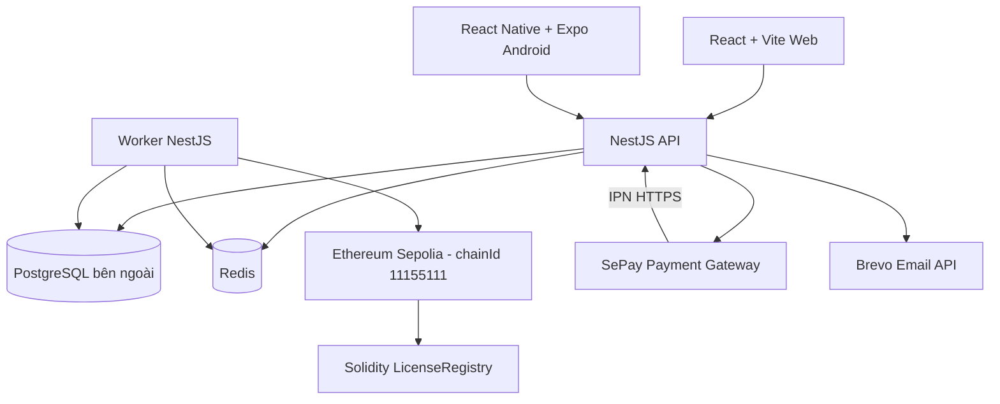

# Công nghệ và kiến trúc hệ thống EmuKey — baseline v5.1-r4

> **Đề tài:** Xây dựng hệ thống quản lý và phân phối bản quyền phần mềm ứng dụng Blockchain  
> **Ngày cập nhật:** 17/09/2026  
> **Phạm vi:** snapshot implementation của repository `EmuKey`; phân biệt rõ dependency đã cài, adapter đã bind, flow đã chạy và target chưa triển khai.

## 1. Tổng quan

EmuKey là hệ thống quản lý bản quyền theo kiến trúc **modular monolith**. Một repository chứa ba delivery unit độc lập:

- `backend`: API NestJS, Worker, PostgreSQL schema và smart contract.
- `frontend`: ứng dụng Web React/Vite.
- `mobile`: ứng dụng Android React Native/Expo.

Backend API và Worker dùng chung mã nguồn, module nghiệp vụ và cơ sở dữ liệu nhưng chạy thành hai process. Hệ thống không tách thành microservices.



## 2. Công nghệ thực tế

| Nhóm | Công nghệ đang dùng | Vai trò và trạng thái |
|---|---|---|
| Runtime | Node.js 22.21.0, TypeScript 6.0.3, ES modules | Runtime và ngôn ngữ chung cho backend, frontend tooling, mobile tooling |
| Package manager | Corepack + pnpm 11.25.0 | Mỗi delivery unit có `package.json` và lockfile riêng; không có root pnpm workspace |
| Backend framework | NestJS 12.0.1 | REST API, dependency injection, module boundary và Worker; WebSocket hiện chỉ là dependency, chưa có Gateway runtime |
| HTTP | `@nestjs/platform-express` | HTTP server; SePay/Brevo dùng SDK riêng và blockchain dùng `viem`. Axios có trong dependency tree nhưng chưa có caller runtime trong `backend/src` |
| API contract | `@nestjs/swagger`, OpenAPI, `@hey-api/openapi-ts` | Backend sinh OpenAPI; Web/Mobile đồng bộ snapshot và chỉ generate TypeScript types, không generate runtime client; HTTP wrapper được viết tay |
| Realtime | Socket.IO 4.8.3, `@nestjs/platform-socket.io` | Dependency đã cài nhưng chưa có Gateway/emit runtime; trạng thái command hiện được Web/Mobile theo dõi bằng HTTP polling 2 giây |
| Database | PostgreSQL 15+, `pg` 8.23.0 | Database authoritative cho identity, catalog, commerce, audit và blockchain projection |
| PostgreSQL extensions | `pgcrypto`, `citext`, `vector` | UUID/hash, email không phân biệt hoa thường và vector embedding schema |
| Cache/scheduling | Redis 8.2 Alpine, `ioredis` 5.11.1, BullMQ 6.3.4 | Redis phục vụ TTL, session/refresh và activation envelope; BullMQ chỉ làm scheduler/trigger đánh thức Worker, còn command và retry state bền vững nằm trong PostgreSQL |
| Web | React 19.2.8, Vite 8.2.2, React Router 7.18.3 | Public verification và các portal Customer/Provider/System/Support |
| UI Web | Ant Design 6.6.2, Ant Design Icons 6.3.4 | Component và icon system của Web |
| Web data fetching | TanStack React Query 5.102.8 | Query/mutation state và cache phía Web |
| Android | React Native 0.86.3, Expo 57.0.22, React 19.2.3 | Ứng dụng Customer trên Android |
| Android navigation/security | React Navigation 7, Expo SecureStore | Navigation; lưu access session, activation key, random device reference và device private key bằng `WHEN_UNLOCKED_THIS_DEVICE_ONLY` |
| Android notification | Expo Notifications | Package đã cài nhưng chưa có runtime registration/delivery flow; production push còn mở |
| Blockchain contract | Solidity, OpenZeppelin Contracts 5.6.1 | `LicenseRegistry` quản lý quyền License/Device trên EVM |
| Blockchain tooling | Hardhat 3.15.0, Hardhat Ignition, Hardhat Toolbox Viem | Solidity compile/unit tests, ABI export, Sepolia deployment with Ignition |
| Blockchain client | viem 2.56.3 | RPC, ABI calls, signing, EIP-1559 transaction, relayer và indexer |
| Payment | `sepay-pg-node` 1.0.0, SePay Sandbox/Production adapter | Tạo checkout form có ký và xác thực IPN; fake adapter vẫn dùng cho local/test |
| Email | Brevo SDK `@getbrevo/brevo` 6.0.3 | Gửi email khi `EMAIL_ADAPTER=brevo`; fake adapter dùng trong test/local |
| AI | Port `AiGatewayPort` và `FakeAiGateway` | Mới là scaffold/binding; chưa có application use case/controller gọi adapter và chưa có Gemini runtime |
| Private storage | `PrivateStoragePort` và `LocalPrivateStorage` | Mới là scaffold/binding; Knowledge UI hiện chưa upload qua backend. Production không được dùng `STORAGE_ADAPTER=local` |
| Authentication | JWT qua `jose`, Argon2id qua `argon2` | Access/refresh token, refresh rotation, session version và password hashing |
| Observability | Pino, `nestjs-pino`, OpenTelemetry SDK/auto-instrumentation | Structured log, redaction và tracing tùy chọn qua `OTEL_ENABLED` |
| Testing | Vitest, Jest/Expo, Testing Library, Supertest, Testcontainers, Playwright, Maestro spec | Unit/integration/contract và local real-RPC đã chạy; Playwright/Maestro real E2E có spec nhưng chưa chạy mặc định vì cần credential/backend/chain, Maestro CLI và Android device |
| Delivery | Docker, Docker Compose, Caddy 2.10.2, GitHub Actions | Image cho backend/frontend/mobile, local orchestration, static web serving/reverse proxy và CI; chưa có CD/deploy workflow |

## 3. Cấu trúc triển khai

### 3.1. Backend

`backend` là một delivery unit TypeScript/NestJS, gồm:

```text
backend/
  src/
    platform/                 # database, Redis, config, health, OpenAPI, observability
    modules/
      identity-access/        # đăng ký, xác minh email, login, JWT, profile, RBAC
      catalog/                # Product, Plan và so sánh Plan
      commerce-payment/       # Order, checkout, SePay/IPN, payment evidence
      licensing/              # challenge/proof, activate/revoke/rotate, lifecycle, entitlement
      blockchain/             # projection query/public verify, command, relayer, indexer, reconcile, envelope
      assistance-support/     # AI/storage ports và fake/local scaffold; chưa có flow API hoàn chỉnh
      operations/             # Brevo/fake email và fake push binding; AuditWriter nằm ở platform
    entrypoints/
      api/                    # process HTTP API
      worker/                 # process BullMQ/chain worker
  contracts/                  # Solidity/Hardhat/ABI/deploy/test vectors
  database/schema.sql         # canonical schema duy nhất, không dùng ORM
  config/service-terms.md      # Platform Service Terms content
```

Các process backend:

- `api`: NestJS HTTP API, health endpoint và Swagger UI. Socket.IO dependency đã cài nhưng chưa có Gateway runtime.
- `worker`: xử lý chain command, index/finality/reconcile, activation envelope và các tác vụ nền.
- `database-initialize`: maintenance command tùy chọn, chỉ áp dụng schema khi database chưa có bảng.

### 3.2. Frontend Web

Frontend dùng React với Vite, Ant Design, React Router và TanStack Query. Web nhận API URL qua `VITE_API_URL`, dùng TypeScript types generate từ OpenAPI cùng HTTP wrappers viết tay — không có generated runtime client — và được build thành static assets. Image runtime dùng Caddy để phục vụ file tĩnh và proxy `/api`.

Các bề mặt API thật hiện có gồm public projection verification, Customer commerce/license/device, Provider catalog/license lifecycle và một phần System account/payment/blockchain operations. Customer Assistance, Provider Knowledge, Support console, notification inbox và một số dashboard vẫn dùng placeholder/mock; sự tồn tại của screen không đồng nghĩa backend flow đã triển khai.

### 3.3. Mobile Android

Mobile dùng React Native + Expo, build bằng `expo export --platform android`. Ứng dụng dùng cùng backend API với Web, không có business API riêng. TypeScript types generate từ OpenAPI được đồng bộ từ backend, còn wrapper HTTP được viết tay; không có generated runtime client. Access token, activation key và device identity được lưu trong Expo SecureStore; entitlement 5 phút chỉ giữ trong memory. Mobile hiện chưa gọi refresh-token rotation nên phải đăng nhập lại khi access token hết hạn. Mobile là delivery/build artifact, không phải service trong Docker Compose mặc định.

## 4. Dữ liệu và PostgreSQL

PostgreSQL là nguồn dữ liệu bền vững cho dữ liệu riêng tư và projection từ blockchain. Schema authority duy nhất là `EmuKey/backend/database/schema.sql`; backend dùng trực tiếp để khởi tạo môi trường mới, không duy trì mirror trong context. Target artefact v7.3 khai báo **18 bảng**. Schema đã create/commit thành công trên PostgreSQL 15 + pgvector disposable, pass fixture đại diện cho paid-origin License/commerce command, ordered late correction, terminal proof/immutability, PostgreSQL Device state, renewal expiry apply/rollback, ChainEvent chronology/re-inclusion và deep ISSUE re-confirmation. Database Neon `EmuKey` hiện đã được reset transactionally bằng artefact byte-identical, verify đủ 18 bảng/229 constraint/50 foreign key/115 index và seed-twice giữ nguyên `4 users, 1 product, 2 plans`; toàn bộ negative matrix vẫn chưa được chứng minh hoàn tất.

| Nhóm | Bảng chính |
|---|---|
| Identity | `users` |
| Catalog | `products`, `plans` |
| Commerce/payment | `orders`, `payment_attempts`, `payment_transactions` |
| Licensing | `licenses`, `license_devices` |
| Blockchain | `chain_commands`, `chain_events`, `chain_indexer_checkpoints` |
| Assistance | `knowledge_documents`, `knowledge_chunks`, `conversations`, `messages` |
| Operations | `notifications`, `mobile_push_tokens`, `audit_logs` |

Các nguyên tắc đang áp dụng:

- Truy cập database bằng `pg` và SQL version-controlled; không dùng TypeORM, Prisma hoặc automatic schema synchronization.
- PostgreSQL không chạy trong Docker Compose mặc định. API, Worker và maintenance command lấy `DATABASE_URL` từ `backend/.env`; môi trường phát triển hiện dùng database PostgreSQL bên ngoài.
- `pgvector` đã được bật trong schema để hỗ trợ knowledge/vector embedding, nhưng AI runtime hiện chưa có Gemini adapter thực tế.
- Database transaction là nơi ghi durable state trước khi đẩy queue hoặc gọi adapter bên ngoài.
- Seed và schema initialization là thao tác explicit, không tự chạy khi `docker compose up`.
- Schema v7.3 dùng DB statement clock cho Order/Attempt lifecycle và IPN `received_at`, lưu immutable `ipn_accept_until` cùng late-correction provenance; guard exact Order↔Attempt↔effect amount/time/status hai chiều theo thứ tự effect -> late-correct Attempt -> `PAYMENT_ACCEPTED`, terminal review/effect immutability và paid-origin cho License/`ISSUE_LICENSE`/`RENEW_LICENSE`. License mới phải bind exact durable effect, `period_start = provider_occurred_at`, quota snapshot và ISSUE cùng transaction. Command sequence dùng latest-confirmed basis cho non-ISSUE, reciprocal replacement/ISSUE recovery và typed resolution proof gồm cả audited nonce release; `ABANDONED/SUPERSEDED` là row bất biến hoàn toàn, `RAW_TX_IRREVOCABLE_NO_EFFECT` loại receipt `SUCCESS/REVERTED`, và `checkedAt` phải là RFC3339 parse được trong biên evidence -> resolution. ChainEvent mới bắt đầu `PENDING`, một confirmed event/command, latest canonical projection pointer đúng event type; Individual Device chỉ có ACTIVE/REVOKED và không có canonical event pointer. Expiry chỉ tăng một lần theo exact confirmed renewal pointer và chỉ giảm khi rollback chính renewal reorg. Event timestamps phải chronological, re-inclusion được observe sau prior reorg; durable evidence no-delete, reorg summary chỉ giữ latest timestamps + count. EVM address/hash được normalize lowercase; provider namespace dùng so sánh case-insensitive.

## 5. Blockchain và bản quyền

### 5.1. Smart contract

Contract `LicenseRegistry` được viết bằng Solidity và dùng OpenZeppelin. Contract là authority cho rights transition của License/Device, gồm:

- Issue và renew License.
- Suspend, resume và revoke License.
- Rotate activation commitment/key version.
- Activate và revoke Device.
- Kiểm tra trạng thái, expiry, key version, device uniqueness và device quota.

Smart contract không lưu plaintext activation secret, Terms content, giá, payment payload hoặc PII. Backend chỉ gửi transaction thông qua relayer.

### 5.2. Mạng và relayer

- `sepolia`: mạng blockchain runtime duy nhất (chainId `11155111`). Hardhat chỉ còn contract tooling: compile Solidity, unit test contract, generate ABI, và deploy contract lên Sepolia bằng Hardhat Ignition. Backend local vẫn kết nối Sepolia; không có local EVM node, không có fallback local.
- `viem`: RPC client, đọc contract, ký và broadcast raw EIP-1559 transaction.
- RPC có primary + optional fallback Sepolia; cả readiness và relayer kiểm tra đúng chain ID/contract, không silently dùng fallback khác network cho command.
- Relayer thật dùng private key inject từ `EVM_RELAYER_PRIVATE_KEY`; không lưu credential thật trong database, source code, log hoặc image.
- Worker lưu durable per-License command sequence/predecessor/latest-confirmed basis event, nonce, raw transaction, transaction hash/receipt và xử lý `SUBMITTED_UNKNOWN`, finality, reorg và reconcile. Với command không phải ISSUE, basis phải là confirmation của command `CONFIRMED` có sequence lớn nhất đứng trước tại lúc tạo/reopen/submit; ISSUE/replacement ISSUE luôn có basis `NULL`. Chỉ command mất matching canonical event của chính nó bị demote. Deep reorg có thể tạo ordered recovery set, lùi pending-key pointer về earliest unresolved ROTATE và khóa command mới. Reserved nonce đơn lẻ có thể `DEAD_LETTER -> PENDING` với nguyên nonce/payload sau revalidation; nếu basis vĩnh viễn không trở lại thì typed `NONCE_RESERVATION_RELEASED` giải phóng reservation và cho reuse đúng nonce. Signed raw+hash có outcome uncertain phải `-> SUBMITTED_UNKNOWN`; raw cũ immutable và chỉ same-raw reconcile. Terminal resolution dùng typed immutable JSON: pre-submit abort trước nonce, nonce reservation release trước raw, reverted receipt, hoặc finalized nonce-consumption + canonical no-effect proof. PostgreSQL tự đóng dấu `resolved_at`; no-effect proof không được có receipt `SUCCESS/REVERTED`, và `checkedAt` phải là valid RFC3339 nằm trong biên evidence đến `resolved_at`. Definitive proof resolve command cũ; retry mới dùng reciprocal replacement, không sửa raw cũ. `SUPERSEDED` phải có reciprocal later replacement cùng operation/subject; ISSUE sequence > 1 bắt buộc là reciprocal replacement; sau khi `ABANDONED/SUPERSEDED`, toàn bộ row command bất biến.

- Security factor không thay ownership: owner JWT luôn được kiểm tra trước bearer key/proof/token. Action token Redis one-time/TTL bind `userId + licenseId + action`; device action bind thêm `deviceRef + generation`. Challenge bind protocol/domain/action/license/device/generation/keyVersion/nonce/expiry. Self-revoke dùng fresh target-device proof, còn remote revoke không cần target proof nhưng cần recent password re-auth; rotate/key-recovery cũng có recent re-auth theo policy.

BullMQ chỉ chạy repeat scheduler để đánh thức worker. Business command, nonce, raw signed transaction, receipt và retry state nằm bền vững trong PostgreSQL `chain_commands`; mỗi tick worker claim command rồi chạy submit/reconcile receipt/index/finality/projection/expiry.

### 5.3. Activation envelope

Activation secret được tạo bằng CSPRNG. ISSUE giữ proposal commitment/version và trust `PENDING_FINALITY`. License đã tồn tại giữ current canonical, còn pending commitment/version trỏ exact earliest unresolved ROTATE bằng `pending_activation_command_id`. Key ChainEvent normalize new/previous commitment+version: confirmation promote exact pending; reorg rollback exact previous và giữ orphan key làm pending. Nếu ISSUE gốc reorg thì License về `PENDING_ONCHAIN`, giữ nguyên ISSUE proposal, clear pending ROTATE projection pointer nhưng giữ ordered ROTATE command/evidence suffix và chưa materialize descendant. Khi ISSUE canonical lại, cùng transaction phải khôi phục exact pending pointer/key của earliest unresolved ROTATE và giữ `UNTRUSTED_REORG`; toàn recovery suffix xong mới `TRUSTED`. PostgreSQL chỉ có thể lưu `activation_key_last4` lowercase làm hint; chain chỉ lưu commitment/version. Raw secret không lưu PostgreSQL/chain/log; Redis chỉ giữ **ciphertext envelope** AES-256-GCM TTL 24 giờ, consume một lần, plaintext chỉ thoáng qua trong process và Customer SecureStore. Trước nonce/raw/hash có thể regenerate atomically; sau đó commitment immutable. Mất key sau resolution hoặc `KEY_ROTATED` mất canonical vĩnh viễn dùng owner recovery; `LICENSE_ISSUED` đi same-raw rồi reciprocal replacement ISSUE cùng commitment đã chốt hoặc refund, không ROTATE License chưa canonical. Redis mất dữ liệu không tự đổi rights.

## 6. Thanh toán và adapter ngoài

### 6.1. CURRENT — flow và evidence hiện có

1. Customer tạo Order và chấp nhận Terms.
2. Backend tạo PaymentAttempt và checkout form SePay có chữ ký server-side.
3. SePay gửi IPN; backend xác thực secret key rồi normalize stable event ID, positive amount, ISO currency và provider occurrence time. Payload không normalize được chỉ ghi security audit redacted; normalized semantic anomaly (gồm currency khác VND) mới vào durable PaymentTransaction/review. Fulfillment VND chỉ xảy ra khi transaction amount = Attempt amount = immutable Order price snapshot.
4. `NEW_PURCHASE`: trong DB transaction, payment thành công commit License `PENDING_ONCHAIN` và `ISSUE_LICENSE` command. Sau commit mới prepare/verify activation envelope; worker chỉ submit khi commitment/envelope khớp.
5. `RENEWAL`: đã có đường tạo Renewal Order/`RENEW_LICENSE` command và chỉ apply expiry sau finality, nhưng chưa được coi là conformance-complete. Target SQL v7.3 đã tách `provider_occurred_at` khỏi `received_at`; việc adapter/repository thực sự validate/use đúng hai timestamp cùng race/negative evidence vẫn nằm trong gate Phase 4.
6. Worker submit transaction; chỉ sau canonical event/finality, projection mới activate License hoặc apply expiry mới.

### 6.2. TARGET — renewal canonical còn gate mở

- Customer owner phải gửi current `X-License-Key`; Renewal Order phải target cùng owner/Provider/Product/Plan/commitment với License và không được biến thành upgrade/downgrade.
- New purchase dùng proposed period từ verified provider time; renewal dùng `addPlanDuration(max(canonical expiresAt, verified provider_occurred_at), duration_months)` với UTC calendar-month/end-of-month clamp. `received_at` chỉ đo delivery/audit; expiry chỉ canonical sau chain finality.
- Target SQL v7.3 có `uq_orders_one_open_renewal`, forward-admission index và per-License admission trigger. Deep reorg vẫn có thể tạo nhiều historical `SUBMITTED_UNKNOWN`, nhưng trigger/application lock chặn command mới khi `SUBMITTED_UNKNOWN` hoặc `DEAD_LETTER` chưa resolve tồn tại. Policy end-to-end vẫn chưa CLOSED cho atomic handoff, concurrent/late IPN, review outcome, recovery và executable evidence.
- Order mới bắt buộc vào `WAITING_TERMS_ACCEPTANCE`; import/seed không được chèn thẳng trạng thái sau hoặc terminal. PostgreSQL tự đóng dấu Order/Attempt lifecycle và IPN `received_at` bằng `statement_timestamp()`, nên caller không thể backdate cutoff. PaymentAttempt hết hạn chỉ đóng reference đó và expire khi `commerceNow >= expires_at`; supersede chỉ trước expiry. CreateOrder snapshot bất biến `ipn_accept_until = payment_due_at + policy grace`; từ due đến cutoff, Order chờ payment là callback-only, tại/sau cutoff mới terminal-expire. Auto/manual fulfillment chỉ từ `WAITING_PAYMENT`, exact Terms/amount, `provider_occurred_at` trong `[max(terms_accepted_at, attempt.created_at), min(attempt.expires_at, payment_due_at))`, thêm `provider_occurred_at < superseded_at` nếu attempt đã supersede, và `received_at < ipn_accept_until`. Cùng transaction phải ghi durable effect trước, late-correct exact Attempt sang `SUCCEEDED` nếu cần, rồi mới project Order `PAYMENT_ACCEPTED`; correction giữ immutable `corrected_from_status + correction_boundary_at` và mọi attempt khác còn `PENDING` phải supersede atomically. License purchase phải bind exact paid effect, `period_start = provider_occurred_at`, quota snapshot và ISSUE cùng transaction; ISSUE/RENEW command không được tồn tại thiếu exact `PAYMENT_ACCEPTED` effect. Durable effect, exact Attempt `SUCCEEDED` và Order `PAYMENT_ACCEPTED` đồng nhất hai chiều tại commit; Order `CANCELLED/EXPIRED` không giữ attempt `PENDING`. Review đi `NONE -> OPEN -> RESOLVED|CLOSED_NO_ACTION`, terminal/effect tuple immutable; `AMOUNT_MISMATCH` không accept trực tiếp và Order terminal không hồi sinh. `canonicalNow` từ finalized block dành cho License/chain temporal state, không thay provider payment time.

`IPN_DELIVERY_GRACE` là deployment policy (không phải client input), phải lớn hơn delivery-latency/retry contract đã chọn của SePay và có boundary test. Policy chỉ tính cutoff khi tạo Order; đổi cấu hình không sửa Order cũ. `provider_occurred_at` còn phải qua bounded clock-skew validation; `received_at` chỉ kiểm tra delivery cutoff/audit, không thay provider time.

Đối với sơ đồ trạng thái, smart contract lưu administrative state `ACTIVE/SUSPENDED/REVOKED`; `EXPIRED` là effective/temporal result từ `expiresAt` theo timestamp của latest finalized block. Renewal của License suspended chỉ đưa expiry về tương lai, không tự resume. Device đã revoke có thể bind lại cùng reference bằng `binding_generation` mới; PostgreSQL lưu lowercase `device_signer_address` suy ra từ public key, còn private key chỉ ở client SecureStore. Runtime hiện bind challenge và activate/revoke command theo purpose + generation, đồng thời expiry worker lấy timestamp của finalized block; request-scoped idempotency đầy đủ và compatibility/manual recovery matrix vẫn là gap Phase 6.

Các adapter có cấu hình:

| Adapter | Local/test | Sandbox/testnet | Production |
|---|---|---|---|
| Payment | `fake` hoặc `sepay` | SePay Sandbox | SePay Production, cần merchant activation và webhook HTTPS |
| Email | fake hoặc Brevo | Brevo nếu có credential | Brevo với secret manager |
| AI | fake | Chưa có Gemini runtime adapter | Chưa sẵn sàng |
| Push | fake | Chưa có provider thật | Chưa sẵn sàng |
| Storage | local private storage | Local trong môi trường phù hợp | Không được dùng local; cần adapter object storage |

## 7. Docker Compose và môi trường chạy

Compose root hiện có các service/profile sau:

| Service | Vai trò |
|---|---|
| `redis` | Redis 8.2 với AOF/TTL; BullMQ chỉ làm scheduler/trigger, không sở hữu durable business command |
| `api` | Backend NestJS HTTP API |
| `worker` | Backend Worker dùng chung image/mã nguồn |
| `web` | Frontend static app chạy trên Caddy |
| `database-initialize` | Maintenance profile, không chạy mặc định |

PostgreSQL là external service và không có service PostgreSQL trong Compose. Các port mặc định được khai báo ở root `.env.example`: API `3000`, Web `5173`, Redis `6379`. Blockchain runtime luôn dùng Sepolia RPC từ `EVM_RPC_HTTP_URL` kể cả khi backend chạy local; không có service chain hoặc deploy contract local.

## 8. CI và kiểm thử

GitHub Actions hiện làm CI validation/build riêng backend, frontend, mobile và Compose; chưa tự deploy release. Các gate chính:

- Backend: baseline/schema check, lint, typecheck, Vitest, contract verification, delivery check, OpenAPI check và build.
- Frontend: lint, typecheck, Vitest, OpenAPI check và Vite build.
- Mobile: Expo dependency check, lint, typecheck, Jest, OpenAPI check và Android export.
- Contract: Hardhat compile/test, public surface check, ABI export.
- Container: build image độc lập cho backend/frontend/mobile; backend image không chứa `.env`, maintenance SQL hoặc source contracts trong runtime image.
- Integration: Testcontainers cung cấp PostgreSQL/Redis cô lập; DB/application invariants (concurrency, idempotency, replay, canonical projection repair, reorg state) test không cần blockchain. Sepolia real transaction test chạy external workflow với manual input, không chạy mỗi push.

Playwright có real activation spec nhưng cần `E2E_CUSTOMER_EMAIL`, `E2E_CUSTOMER_PASSWORD`, `E2E_ACTIVATION_KEY` và backend/chain chạy. Mobile có Maestro YAML nhưng cần Maestro CLI, Android device và môi trường tích hợp. Hai flow này chưa được chạy mặc định trong CI, nên không phải bằng chứng full UI E2E hiện tại.

## 9. Cấu hình môi trường quan trọng

Các biến chính nằm trong `backend/.env.example`:

```text
DATABASE_URL=
REDIS_URL=redis://localhost:6379
JWT_SECRET=
PAYMENT_ADAPTER=fake|sepay
PAYMENT_WEBHOOK_SECRET=
SEPAY_ENV=sandbox|production
SEPAY_MERCHANT_ID=
SEPAY_SECRET_KEY=
EMAIL_ADAPTER=brevo|fake
BREVO_API_KEY=
BREVO_SENDER_EMAIL=
BREVO_SENDER_NAME=
WEB_APP_URL=
AI_ADAPTER=fake
PUSH_ADAPTER=fake
STORAGE_ADAPTER=local
ACTIVATION_ENVELOPE_ADAPTER=redis
ACTIVATION_ENVELOPE_KEY=
EVM_ADAPTER=viem
EVM_NETWORK=sepolia
EVM_CHAIN_ID=11155111
EVM_RPC_HTTP_URL=https://sepolia-provider
EVM_RPC_FALLBACK_HTTP_URL=https://sepolia-fallback
EVM_DEPLOYMENT_BLOCK=
EVM_INDEXER_BATCH_SIZE=
EVM_CONTRACT_ADDRESS=0x...
EVM_RELAYER_PRIVATE_KEY=
EVM_CONFIRMATIONS=
TERMS_VERSION=
TERMS_APPROVED_HASH=
```

Giá trị secret thật không được commit. Production phải dùng secret manager/injection phù hợp.

## 10. Phạm vi chưa phải công nghệ đang sử dụng

Các công nghệ sau không nên được mô tả là thành phần hiện tại của EmuKey:

- TypeORM, Prisma hoặc ORM khác.
- Local PostgreSQL service trong Docker Compose.
- Kotlin/Jetpack Compose test client.
- Customer Controller, per-account blockchain key hoặc KMS.
- Contract PDF/signing pipeline.
- Gemini production adapter, object storage cloud adapter, push provider production.
- Microservices độc lập cho API, Worker, payment hoặc blockchain.

## 11. Trạng thái và giới hạn

Baseline hiện tại có API, Worker, Redis, PostgreSQL external và Sepolia-only blockchain. SePay Sandbox flow, Sepolia contract deployment và ISSUE relayer/indexer evidence riêng lẻ đã được kiểm tra độc lập; chưa có bằng chứng automated full SePay-to-Sepolia Web/Mobile E2E hoặc toàn bộ lifecycle Phase 6 trên Sepolia. Target SQL v7.3 đã pass disposable clean-room, representative Order/payment/chain negative fixtures, reset/apply database Neon thật và seed-twice idempotency; còn toàn bộ negative matrix. Hệ thống chưa production-ready vì còn ownership hardening Phase 6, key-unavailable recovery, order/payment lifecycle acceptance tests, Mobile refresh, E2E external, CD/TLS/monitoring, merchant Production, secret/RPC/finality production, approved Terms và adapter thật cho AI/push/object storage.

Các mismatch runtime quan trọng phải giữ trong implementation plan thay vì che bằng sơ đồ target: Support route còn quyền payment/reconcile vượt actor authority; reset/change password chưa đồng nhất policy 8 ký tự; runtime payment chưa có evidence dùng đúng target `provider_occurred_at/received_at`; renewal chưa CLOSED atomic handoff/per-License admission/recovery; Device rebind chưa có đủ generation evidence; dead-letter chưa có manual recovery/compensation hoàn chỉnh; Terms loader mới có một approved hash hiện hành. Đây là status theo PLAN, không được suy target SQL đã hoàn tất runtime.

### Lịch sử cập nhật

| Phiên bản | Ngày | Nội dung |
|---|---|---|
| **5.1-r4** | **17/09/2026** | Tách CURRENT/TARGET và mức evidence; đồng bộ SQL v7.3 với IPN cutoff/window, immutable payment effect/review, reciprocal command replacement, one-confirmed event, key before/after evidence + pending pointer/trust recovery; cập nhật security factors, generated wrappers, polling/BullMQ và Redis ciphertext envelope. |
| **5.1-r3** | **16/09/2026** | Chuẩn hóa graph License/Device, renewal payment time, manual reconcile authority và các gap xuyên Order/ChainCommand. |
| **5.1-r2** | **16/09/2026** | Phân biệt dependency/scaffold/runtime; làm rõ worker polling, purchase/renewal, action token/device proof/entitlement, envelope recovery boundary và mức bằng chứng local/Sandbox/Sepolia/E2E. |
| **5.1-r1** | **15/09/2026** | Đồng bộ stack repository: Node/NestJS/React/Expo, PostgreSQL external, Redis/BullMQ, Hardhat/viem, SePay SDK, Caddy và CI. |
| 5.1 | 11/09/2026 | Baseline Customer account/JWT; loại Customer Controller, per-account key và KMS. |
